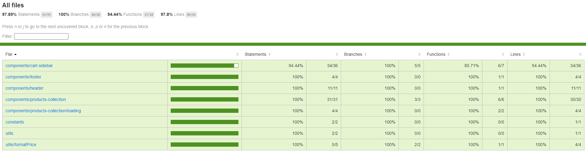

# MKS Sistemas - Loja de Produtos

Este repositório contém o código-fonte para a aplicação de e-commerce desenvolvida como parte de um desafio técnico. A aplicação foi construída utilizando Next.js e outras tecnologias modernas para exibir uma lista de produtos e gerenciar um carrinho de compras.

## Tecnologias Utilizadas

- **Next.js**: Framework React para produção.
- **React Query**: Biblioteca para gerenciamento de estado e busca de dados.
- **Styled-Components**: Para estilização.
- **Framer Motion**: Para animações.
- **Material UI**: Para skeleton e tooltip.
- **Jest e Testing-Library**: Para testes unitários.

## Funcionalidades

- **Visualização de Produtos**: Os produtos são buscados de uma API REST e exibidos na página principal.
- **Carrinho de Compras**: Os usuários podem adicionar produtos ao carrinho e ajustar a quantidade de cada item.

## Rodando o Projeto Localmente

Para executar este projeto localmente, siga estes passos:

1. Clone o repositório:
   ```bash
   git clone https://github.com/lucassilva3g/MKS-Sistemas.git

2. Instale as dependências:

```bash
npm install
```

3. Execute o servidor de desenvolvimento:
```bash
npm run dev
```

Acesse http://localhost:3000 no navegador para ver a aplicação em funcionamento.

## Executando Testes

1. Para executar os testes unitários, execute o seguinte comando:

```bash
npm run test
```

2. Para gerar um relatório de cobertura de testes, execute o seguinte comando:

```bash
npm run test:coverage
```

Após a execução dos testes, um relatório de cobertura será gerado na pasta `coverage`.

Acesse `coverage/lcov-report/index.html` no navegador para visualizar o relatório.



## Deploy

A aplicação foi implantada usando [Vercel](https://vercel.com). Você pode acessar a aplicação em produção através deste link: [MKS Sistemas na Vercel](https://mks-sistemas-lime.vercel.app/).


## Contribuições
Contribuições são bem-vindas. Para contribuir, por favor abra um pull request com suas sugestões de melhorias ou correções.
